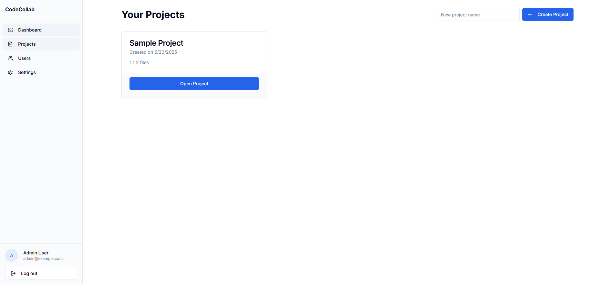

# CodeCollab - Collaborative Text Editor

A real-time collaborative text and code editor with project management, user authentication, and a built-in terminal.

## Features

- **User Authentication**: Secure login and registration system
- **Project Management**: Create, manage, and collaborate on multiple projects
- **Real-time Collaboration**: Edit code together with team members in real-time
- **File Management**: Create, edit, and delete files within projects
- **Built-in Terminal**: Execute commands directly in the browser
- **Syntax Highlighting**: Support for multiple programming languages
- **Responsive Design**: Works on desktop and mobile devices
- **User Management**: Invite team members and manage permissions

## Technologies Used

- **Frontend**: Next.js, React, TypeScript, Tailwind CSS
- **UI Components**: shadcn/ui
- **Authentication**: Custom auth system (can be replaced with NextAuth.js)
- **State Management**: React Context API
- **Styling**: Tailwind CSS with shadcn/ui components
- **Code Editor**: CodeMirror
- **Real-time Collaboration**: Yjs, WebSockets

## Getting Started

### Prerequisites

- Node.js 18.x or later
- npm, yarn, or pnpm

### Installation

#### Option 1: Download from v0

1. Click the "Download Code" button in the top right corner of the v0 interface
2. Extract the downloaded ZIP file to your desired location
3. Open a terminal and navigate to the extracted folder

#### Option 2: Clone the repository

\`\`\`bash
git clone https://github.com/raselahmedweb/code-collab.git
cd codecollab
\`\`\`

### Install dependencies

\`\`\`bash
# Using npm
npm install

# Using yarn
yarn

# Using pnpm
pnpm install
\`\`\`

### Run the development server

\`\`\`bash
# Using npm
npm run dev

# Using yarn
yarn dev

# Using pnpm
pnpm dev
\`\`\`

Open [http://localhost:3000](http://localhost:3000) in your browser to see the application.

## Usage

### Login Credentials

For the demo version, you can use these credentials:

- **Admin User**:
  - Email: admin@example.com
  - Password: admin123

- **Regular User**:
  - Email: user@example.com
  - Password: user123

### Creating a Project

1. Log in to your account
2. Navigate to the dashboard
3. Click "Create Project" and enter a project name
4. Click "Create" to create your new project

### Adding Files

1. Open a project
2. Enter a file name in the input field
3. Click the "+" button to create the file
4. Start editing your file in the editor

### Using the Terminal

1. Click the terminal icon in the bottom right corner
2. Type `help` to see available commands
3. Use commands like `ls`, `touch`, `cat`, and `npm install` to manage your project

### Inviting Team Members

1. Open a project
2. Go to the "Users" tab
3. Enter the email address of the user you want to invite
4. Select their role (Editor or Viewer)
5. Click "Add User" to send the invitation

## Project Structure

\`\`\`
codecollab/
├── app/                  # Next.js App Router
│   ├── api/              # API routes
│   ├── dashboard/        # Dashboard pages
│   ├── login/            # Authentication pages
│   ├── project/          # Project pages
│   ├── settings/         # User settings
│   ├── globals.css       # Global styles
│   └── layout.tsx        # Root layout
├── components/           # React components
│   ├── ui/               # UI components (shadcn/ui)
│   ├── editor.tsx        # Code editor component
│   ├── sidebar.tsx       # Sidebar navigation
│   ├── terminal.tsx      # Terminal component
│   └── ...
├── lib/                  # Utility functions and hooks
│   ├── auth.ts           # Authentication utilities
│   ├── files.ts          # File management
│   ├── projects.ts       # Project management
│   └── ...
├── public/               # Static assets
├── .eslintrc.json        # ESLint configuration
├── next.config.js        # Next.js configuration
├── package.json          # Project dependencies
├── tailwind.config.js    # Tailwind CSS configuration
└── tsconfig.json         # TypeScript configuration
\`\`\`

## Customization

### Changing the Theme

The application uses Tailwind CSS with a customizable theme. You can modify the theme in `app/globals.css` and `tailwind.config.js`.

### Adding Authentication Providers

The current implementation uses a mock authentication system. You can replace it with NextAuth.js or any other authentication provider by modifying the `lib/auth.ts` and `lib/auth-provider.tsx` files.

### Adding Features

The codebase is modular and well-organized, making it easy to add new features:

- Add new components in the `components/` directory
- Add new pages in the `app/` directory
- Add new API routes in the `app/api/` directory

## Contributing

Contributions are welcome! Please feel free to submit a Pull Request.

1. Fork the repository
2. Create your feature branch (`git checkout -b feature/amazing-feature`)
3. Commit your changes (`git commit -m 'Add some amazing feature'`)
4. Push to the branch (`git push origin feature/amazing-feature`)
5. Open a Pull Request

## License

This project is licensed under the MIT License - see the LICENSE file for details.

## Acknowledgments

- [Next.js](https://nextjs.org/)
- [React](https://reactjs.org/)
- [Tailwind CSS](https://tailwindcss.com/)
- [shadcn/ui](https://ui.shadcn.com/)
- [CodeMirror](https://codemirror.net/)
- [Yjs](https://yjs.dev/)

---
